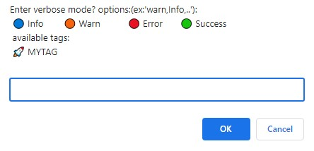
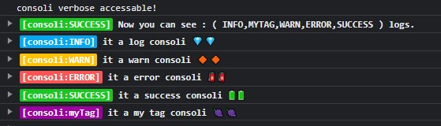

# Consoli js


[](https://GitHub.com/MajidAlinejad/consolijs/contributors/)
[](https://github.com/MajidAlinejad/consolijs/blob/master/LICENSE)
[](https://github.com/MajidAlinejad/consolijs/compare)


<br />
<div align="center">
  
</div>
<br />
<br />

Consoli is a new simple and fancy logger that help you even in production mode.

## Features

- ☑ Typescript.
- ⭐️ tag property of logs.
- 👁 see logs even in production.
- ☄️ Colorize tags.

## Installation

This module is distributed via npm which is bundled with node and should be installed as one of your project's `dependencies`:

```
npm i consolijs
```

**🚨This package is standalone and have no any other dependacy.🚨**

## Usage

`consoliClient.ts`

```JSX
import { Consoli } from "consoli";

export const consoli = new Consoli({

  nodeEnv: import.meta.env.MODE,
  secretKey: import.meta.env.VITE_CONSOLI,
  defaultDeveloperMode: ["SUCCESS"],
  tags: [{ displayName: "myTag", color: "#9f00a1" }],

});

```

`main.ts`

```JSX
import { consoli } from "./consoliClient";

window.consoli = consoli; // for global usage
window.verbose = async () => {
  await consoli.verbose();
};

consoli.log("it a log consoli 💎💎");
consoli.warn("it a warn consoli 🔶🔶");
consoli.error("it a error consoli 🧯🧯");
consoli.success("it a success consoli 🔋🔋");
consoli.tags?.myTag("it a my tag consoli 🍇🍇");

```

`global.d.ts`

```JSX
interface Window {
  verbose: () => Promise<void>;
  consoli: Consoli<"myTag">;
}

```

## Usage in client

**Press F12 , go to consol tab and write:**

```JSX
verbose()
```

**And you see :**

<div style="display:flex">
  
  
</div>

## Avalilible Params

| property               | type                      | description                                 |
| ---------------------- | ------------------------- | ------------------------------------------- |
| `onMessageCallback`    | `void`                    | callback after get the message.             |
| `defaultDeveloperMode` | `SUCCESS,INFO,WARN,ERROR` | default enabled options for developer mode. |
| `tags`                 | `Array of Tags`           | .                                           |

## LICENSE

MIT
